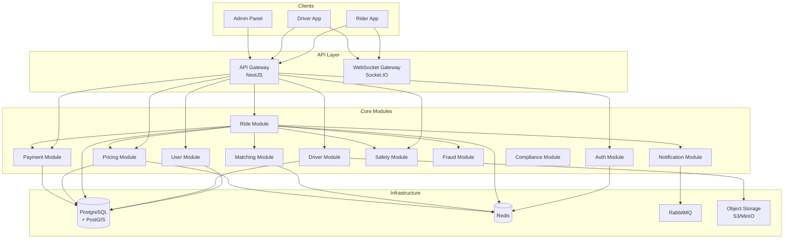
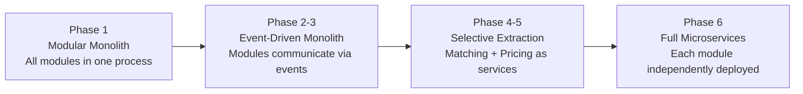
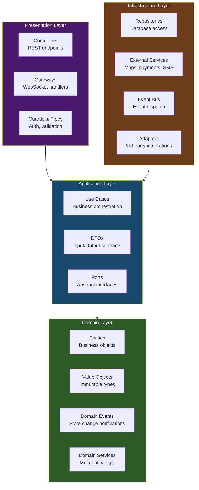
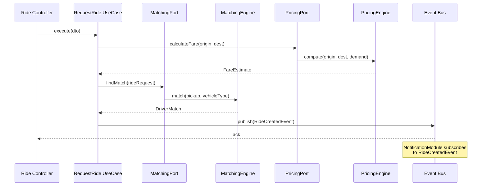
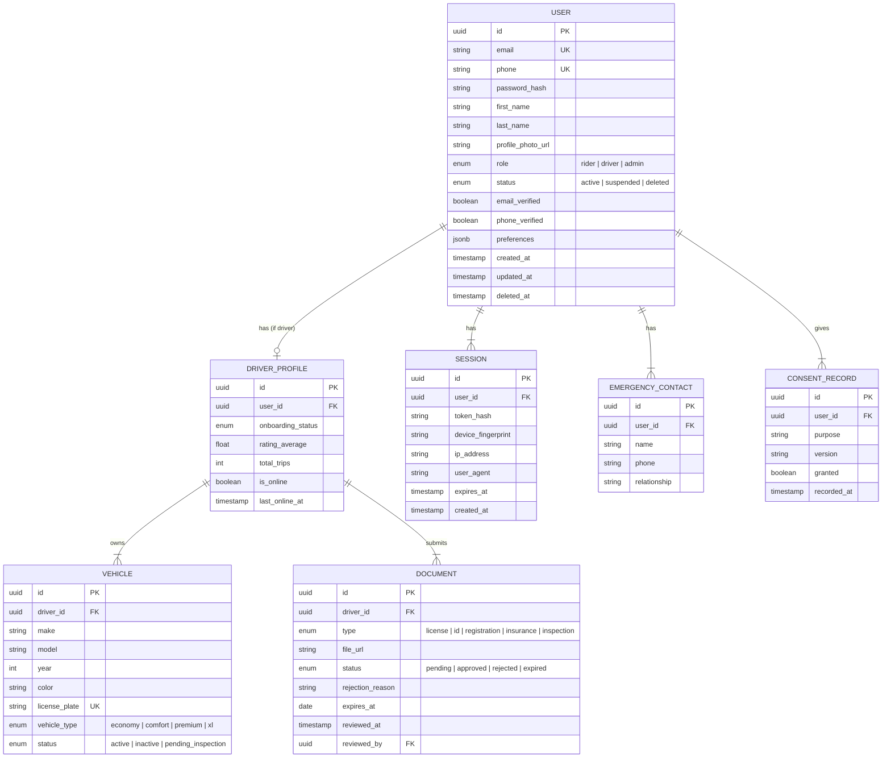
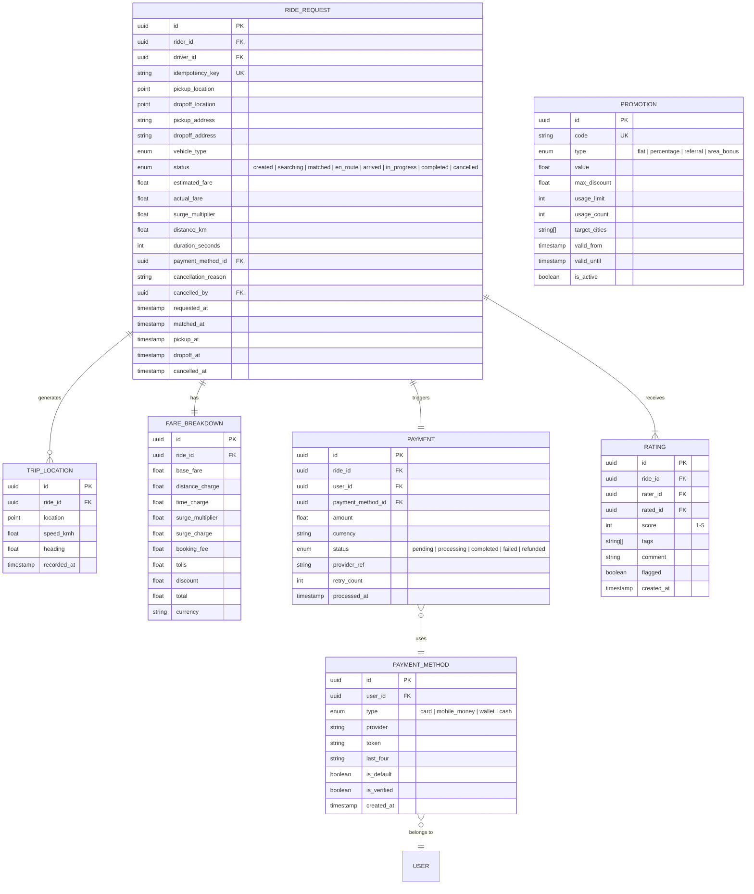
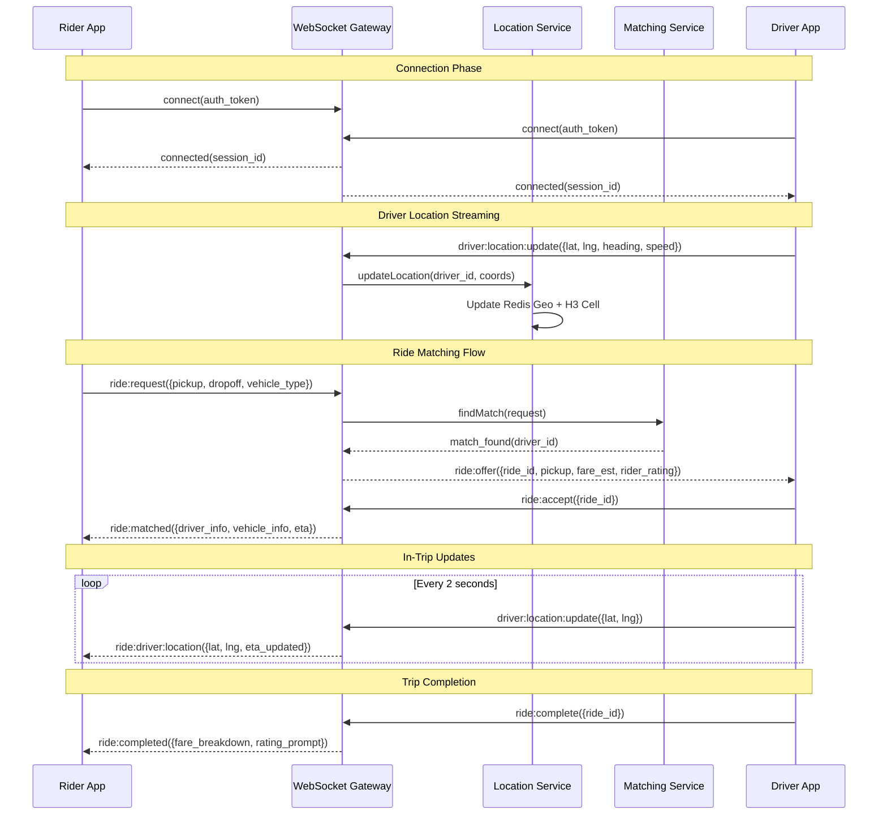
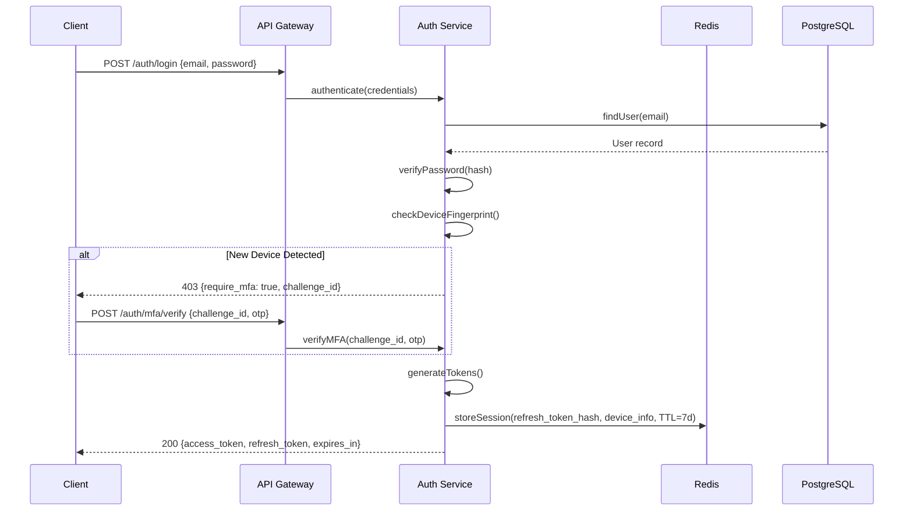
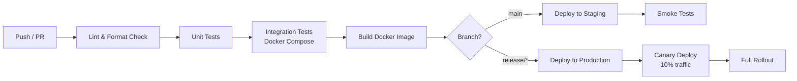

# Driverless — Technical Design Document (TDD)

**Version:** 1.0  
**Date:** March 6, 2026  
**Status:** Draft  
**Author:** Kellendia Engineering

---

## Table of Contents

1. [System Architecture](#1-system-architecture)
2. [Technology Stack](#2-technology-stack)
3. [Module Architecture (Clean Architecture)](#3-module-architecture)
4. [Data Architecture](#4-data-architecture)
5. [API Design](#5-api-design)
6. [Real-Time Architecture](#6-real-time-architecture)
7. [Security Architecture](#7-security-architecture)
8. [Infrastructure & Deployment](#8-infrastructure--deployment)
9. [Testing Strategy](#9-testing-strategy)
10. [Observability](#10-observability)

---

## 1. System Architecture

### 1.1 High-Level Overview

Driverless is architected as a **modular monolith** with a clear migration path to microservices. Each domain module is self-contained, communicating through well-defined interfaces (ports) and domain events. When a module outgrows the monolith, it can be extracted into its own service by replacing in-process event dispatch with message-broker-based events.



### 1.2 Architectural Principles

| Principle | Description |
|-----------|-------------|
| **Modular Monolith** | Start as one deployable unit with strict module boundaries; split only when metrics justify it |
| **Clean Architecture** | Domain logic has zero external dependencies; all I/O flows through ports/adapters |
| **Event-Driven** | Modules communicate via domain events — decoupled, auditable, replayable |
| **Design for Failure** | Every external call has a circuit breaker, retry, and fallback path |
| **Privacy by Design** | Data minimization, purpose limitation, and consent are architectural concerns, not afterthoughts |
| **Observability First** | Structured logging, correlation IDs, and metrics from day one |

### 1.3 Module Evolution Strategy



> **Case Study Note:** Uber's premature move to thousands of microservices created a distributed monolith nightmare — cascading failures, debugging complexity, and dependency hell. We start monolithic intentionally and extract only when module-specific scaling demands require it.

---

## 2. Technology Stack

### 2.1 Core Stack

| Layer | Technology | Justification |
|-------|-----------|---------------|
| **Runtime** | Node.js 20 LTS | Event-loop model ideal for I/O-heavy ride-hailing workloads |
| **Framework** | NestJS 11 | Module system aligns with Clean Architecture; mature DI container; first-class TypeScript |
| **Language** | TypeScript 5.7 | Type safety across the full stack; excellent DX |
| **ORM** | TypeORM | Active Record + Data Mapper patterns; PostGIS support; migration system |
| **Primary DB** | PostgreSQL 16 + PostGIS | ACID transactions, JSON support, geospatial queries, battle-tested |
| **Cache** | Redis 7 | Sub-ms latency for location cache, session store, rate limiting, pub/sub |
| **Message Broker** | RabbitMQ 3.12 | Reliable delivery for domain events, dead-letter queues, manageable complexity |
| **Real-Time** | Socket.IO 4 | WebSocket with auto-reconnect, room support, fallback to long-polling |
| **Object Storage** | MinIO (dev) / S3 (prod) | Document uploads (driver docs, profile photos) |
| **Geospatial** | Uber H3 (`h3-js`) | Hexagonal grid for spatial indexing at O(1) cell lookup |

### 2.2 Development & Infrastructure

| Tool | Purpose |
|------|---------|
| Docker + Docker Compose | Local development environment |
| GitHub Actions | CI/CD pipeline |
| ESLint + Prettier | Code quality and formatting |
| Jest | Unit and integration testing |
| Supertest | HTTP integration testing |
| k6 | Load and performance testing |
| Swagger / OpenAPI 3.0 | API documentation (auto-generated from decorators) |
| Prometheus + Grafana | Metrics collection and dashboarding |
| Pino | Structured JSON logging |

---

## 3. Module Architecture

### 3.1 Clean Architecture Layers

Every module follows a four-layer architecture with strict dependency rules: outer layers depend on inner layers, never the reverse.



### 3.2 Directory Structure

```
src/
├── main.ts                          # Application entry point
├── app.module.ts                    # Root module — imports all feature modules
│
├── common/                          # Shared kernel
│   ├── decorators/                  # Custom decorators (@CurrentUser, @Roles)
│   ├── exceptions/                  # Domain exception classes
│   ├── filters/                     # Global exception filters
│   ├── guards/                      # Auth & role guards
│   ├── interceptors/                # Logging, transform interceptors
│   ├── pipes/                       # Validation pipes
│   ├── interfaces/                  # Shared interfaces (IRepository, IEventBus)
│   ├── value-objects/               # Shared VOs (Money, Coordinates, PhoneNumber)
│   └── utils/                       # Pure utility functions
│
├── config/                          # Configuration module
│   ├── config.module.ts
│   ├── database.config.ts
│   ├── redis.config.ts
│   ├── auth.config.ts
│   └── app.config.ts
│
└── modules/
    ├── user/                        # Phase 1 — User Management
    │   ├── domain/
    │   │   ├── entities/
    │   │   │   └── user.entity.ts
    │   │   ├── value-objects/
    │   │   │   ├── email.vo.ts
    │   │   │   └── phone-number.vo.ts
    │   │   ├── events/
    │   │   │   ├── user-created.event.ts
    │   │   │   └── user-deleted.event.ts
    │   │   └── enums/
    │   │       └── user-role.enum.ts
    │   ├── application/
    │   │   ├── use-cases/
    │   │   │   ├── create-user.use-case.ts
    │   │   │   ├── update-profile.use-case.ts
    │   │   │   └── delete-user.use-case.ts
    │   │   ├── dtos/
    │   │   │   ├── create-user.dto.ts
    │   │   │   └── update-profile.dto.ts
    │   │   └── ports/
    │   │       └── user-repository.port.ts
    │   ├── infrastructure/
    │   │   ├── repositories/
    │   │   │   └── typeorm-user.repository.ts
    │   │   ├── mappers/
    │   │   │   └── user.mapper.ts
    │   │   └── schemas/
    │   │       └── user.schema.ts
    │   ├── presentation/
    │   │   └── controllers/
    │   │       └── user.controller.ts
    │   ├── user.module.ts
    │   └── CASE_STUDY.md            # 📓 Journal entry for this module
    │
    ├── auth/                        # Phase 1 — Authentication
    │   ├── domain/
    │   ├── application/
    │   ├── infrastructure/
    │   ├── presentation/
    │   ├── auth.module.ts
    │   └── CASE_STUDY.md
    │
    ├── driver/                      # Phase 1 — Driver Onboarding
    │   └── ... (same structure)
    │
    ├── location/                    # Phase 2 — Geospatial
    │   └── ...
    │
    ├── ride/                        # Phase 3 — Ride Lifecycle
    │   └── ...
    │
    ├── matching/                    # Phase 3 — Matching Engine
    │   └── ...
    │
    ├── pricing/                     # Phase 4 — Dynamic Pricing
    │   └── ...
    │
    ├── payment/                     # Phase 4 — Payments
    │   └── ...
    │
    ├── safety/                      # Phase 5 — Safety Features
    │   └── ...
    │
    ├── fraud/                       # Phase 5 — Fraud Detection
    │   └── ...
    │
    ├── notification/                # Phase 6 — Notifications
    │   └── ...
    │
    └── compliance/                  # Phase 6 — Regulatory
        └── ...
```

### 3.3 Cross-Module Communication

Modules never import each other's internal classes directly. Communication happens through:

1. **Domain Events** — published by source module, subscribed by consumer modules
2. **Port Interfaces** — consumer defines what it needs; provider implements it
3. **Shared Kernel** — truly shared concepts (Money, Coordinates) live in `common/`



---

## 4. Data Architecture

### 4.1 Entity-Relationship Overview (Phase 1)



### 4.2 Entity-Relationship Overview (Phase 2-4)



### 4.3 Database Strategy

| Data Type | Storage | Rationale |
|-----------|---------|-----------|
| User / Driver / Vehicle data | PostgreSQL | Transactional consistency, relational integrity |
| Trip & fare data | PostgreSQL | Auditable, queryable, relational |
| Real-time driver locations | Redis (Geo) | Sub-ms reads for "drivers near me" queries |
| Location history | PostgreSQL (TimescaleDB extension) | Time-series optimized for trip replay and analytics |
| Sessions & rate limits | Redis | Ephemeral, high-throughput, auto-expiry via TTL |
| H3 cell metrics | Redis (Hash) | Rapidly updated aggregates, read-heavy |
| Driver documents / photos | S3 / MinIO | Binary blob storage, CDN-cacheable |
| Domain events | RabbitMQ → PostgreSQL (event store) | In-flight via broker, persisted for replay |
| Fraud rules & risk scores | PostgreSQL + Redis | Rules in PG, real-time score cache in Redis |

### 4.4 Migration Strategy

- TypeORM migrations for schema changes, generated and checked into version control
- All migrations **idempotent** — using `IF NOT EXISTS` / `IF EXISTS` guards
- Naming convention: `{timestamp}-{DescriptionInPascalCase}.ts`
- No data migrations in schema migration files — separate scripts for data backfills

> **Case Study Note:** Uber's migration strategy evolved from "run and pray" to idempotent, reversible migrations with feature flags. Non-idempotent migrations caused repeated `Duplicate column name` errors and required manual intervention during rollbacks.

---

## 5. API Design

### 5.1 Conventions

| Convention | Standard |
|------------|----------|
| Protocol | HTTPS (TLS 1.3) |
| Format | JSON (application/json) |
| Versioning | URI-based: `/api/v1/...` |
| Naming | kebab-case for URLs, camelCase for JSON fields |
| Pagination | Cursor-based for lists (`?cursor=xyz&limit=20`) |
| Filtering | Query params: `?status=active&city=lagos` |
| Sorting | `?sort=created_at&order=desc` |
| Error format | RFC 7807 Problem Details |

### 5.2 Error Response Format

```json
{
  "type": "https://driverless.dev/errors/validation-error",
  "title": "Validation Error",
  "status": 422,
  "detail": "The phone number format is invalid for the selected country.",
  "instance": "/api/v1/users/register",
  "errors": [
    {
      "field": "phone",
      "message": "Must be a valid E.164 phone number",
      "code": "INVALID_PHONE_FORMAT"
    }
  ],
  "traceId": "abc123-def456-ghi789"
}
```

### 5.3 Core API Endpoints (Phase 1)

#### Users

| Method | Endpoint | Description | Auth |
|--------|----------|-------------|------|
| POST | `/api/v1/auth/register` | Register new user | Public |
| POST | `/api/v1/auth/login` | Login (returns JWT) | Public |
| POST | `/api/v1/auth/refresh` | Refresh access token | Refresh token |
| POST | `/api/v1/auth/logout` | Invalidate session | Bearer |
| POST | `/api/v1/auth/otp/send` | Send OTP | Public |
| POST | `/api/v1/auth/otp/verify` | Verify OTP | Public |
| GET | `/api/v1/users/me` | Get current user profile | Bearer |
| PATCH | `/api/v1/users/me` | Update profile | Bearer |
| DELETE | `/api/v1/users/me` | Delete account (soft) | Bearer + MFA |
| POST | `/api/v1/users/me/data-export` | Request GDPR data export | Bearer |

#### Drivers

| Method | Endpoint | Description | Auth |
|--------|----------|-------------|------|
| POST | `/api/v1/drivers/apply` | Start driver application | Bearer (rider) |
| GET | `/api/v1/drivers/me/status` | Get onboarding status | Bearer (driver) |
| POST | `/api/v1/drivers/me/documents` | Upload document | Bearer (driver) |
| GET | `/api/v1/drivers/me/documents` | List submitted documents | Bearer (driver) |
| PATCH | `/api/v1/drivers/me/online` | Toggle online/offline | Bearer (driver) |

#### Admin

| Method | Endpoint | Description | Auth |
|--------|----------|-------------|------|
| GET | `/api/v1/admin/users` | Search users | Bearer (admin) |
| GET | `/api/v1/admin/users/:id` | Get user details | Bearer (admin) |
| POST | `/api/v1/admin/users/:id/suspend` | Suspend user | Bearer (admin) |
| GET | `/api/v1/admin/drivers/pending` | List pending verifications | Bearer (admin) |
| POST | `/api/v1/admin/documents/:id/review` | Approve/reject document | Bearer (admin) |

### 5.4 Core API Endpoints (Phase 2-4)

#### Rides

| Method | Endpoint | Description | Auth |
|--------|----------|-------------|------|
| POST | `/api/v1/rides/estimate` | Get fare estimate | Bearer (rider) |
| POST | `/api/v1/rides/request` | Request a ride | Bearer (rider) |
| GET | `/api/v1/rides/:id` | Get ride details | Bearer |
| POST | `/api/v1/rides/:id/cancel` | Cancel ride | Bearer |
| POST | `/api/v1/rides/:id/rate` | Rate ride | Bearer |
| GET | `/api/v1/rides/history` | Get ride history | Bearer |

#### Driver Actions

| Method | Endpoint | Description | Auth |
|--------|----------|-------------|------|
| POST | `/api/v1/driver/rides/:id/accept` | Accept ride request | Bearer (driver) |
| POST | `/api/v1/driver/rides/:id/decline` | Decline ride request | Bearer (driver) |
| POST | `/api/v1/driver/rides/:id/arrived` | Mark arrived at pickup | Bearer (driver) |
| POST | `/api/v1/driver/rides/:id/start` | Start trip | Bearer (driver) |
| POST | `/api/v1/driver/rides/:id/complete` | Complete trip | Bearer (driver) |

#### Payments

| Method | Endpoint | Description | Auth |
|--------|----------|-------------|------|
| GET | `/api/v1/payments/methods` | List payment methods | Bearer |
| POST | `/api/v1/payments/methods` | Add payment method | Bearer |
| DELETE | `/api/v1/payments/methods/:id` | Remove payment method | Bearer |
| GET | `/api/v1/drivers/me/earnings` | Get earnings dashboard | Bearer (driver) |
| POST | `/api/v1/drivers/me/payout` | Request instant payout | Bearer (driver) |

---

## 6. Real-Time Architecture

### 6.1 WebSocket Events



### 6.2 Socket.IO Room Strategy

| Room | Members | Purpose |
|------|---------|---------|
| `user:{user_id}` | Single user | Personal notifications, account events |
| `ride:{ride_id}` | Rider + assigned driver | Trip-specific updates (location, status) |
| `city:{city_id}:drivers` | All online drivers in city | Broadcast demand signals, repositioning suggestions |
| `cell:{h3_cell_id}` | All entities in cell | Cell-level supply/demand notifications |
| `admin:{admin_id}` | Single admin | Real-time dashboard updates |

### 6.3 Event Catalog

| Event | Direction | Payload |
|-------|-----------|---------|
| `driver:location:update` | Driver → Server | `{ lat, lng, heading, speed, timestamp }` |
| `ride:offer` | Server → Driver | `{ rideId, pickup, distance, fareEstimate, riderRating, expiresAt }` |
| `ride:accept` | Driver → Server | `{ rideId }` |
| `ride:decline` | Driver → Server | `{ rideId, reason? }` |
| `ride:matched` | Server → Rider | `{ driverName, vehicleInfo, eta, driverLocation }` |
| `ride:driver:location` | Server → Rider | `{ lat, lng, eta, heading }` |
| `ride:status` | Server → Both | `{ rideId, status, timestamp }` |
| `ride:completed` | Server → Both | `{ rideId, fareBreakdown, ratingPrompt }` |
| `ride:cancelled` | Server → Both | `{ rideId, cancelledBy, reason }` |
| `safety:check` | Server → Rider | `{ rideId, anomalyType, prompt }` |
| `safety:response` | Rider → Server | `{ rideId, response: 'fine' \| 'help' }` |

---

## 7. Security Architecture

### 7.1 Authentication Flow



### 7.2 Security Layers

| Layer | Mechanism | Coverage |
|-------|-----------|----------|
| **Transport** | TLS 1.3 | All client-server communication |
| **Authentication** | JWT (access) + opaque (refresh) | All protected endpoints |
| **Authorization** | RBAC guards + per-resource ownership checks | All data access |
| **Input Validation** | class-validator + class-transformer pipes | All incoming data |
| **Rate Limiting** | Redis-backed token bucket per IP + per user | All endpoints |
| **CSRF** | SameSite cookies + CSRF tokens (web admin) | Admin panel |
| **SQL Injection** | Parameterized queries via TypeORM | All database queries |
| **XSS** | Content-Security-Policy headers | Web responses |
| **Data Encryption** | AES-256-GCM for PII at rest | User PII columns |

### 7.3 Rate Limiting Strategy

| Endpoint Category | Limit | Window | Key |
|-------------------|-------|--------|-----|
| Auth (login/register) | 5 requests | 1 minute | IP |
| Auth (OTP send) | 3 requests | 5 minutes | Phone number |
| Ride request | 10 requests | 1 minute | User ID |
| General API | 100 requests | 1 minute | User ID |
| Admin API | 200 requests | 1 minute | User ID |
| WebSocket events | 60 events | 1 minute | Session ID |

---

## 8. Infrastructure & Deployment

### 8.1 Development Environment

```yaml
# docker-compose.yml (simplified)
services:
  app:
    build: .
    ports: ["3000:3000"]
    depends_on: [postgres, redis, rabbitmq]
    environment:
      - NODE_ENV=development
      - DB_HOST=postgres
      - REDIS_HOST=redis
      - RABBITMQ_URL=amqp://rabbitmq

  postgres:
    image: postgis/postgis:16-3.4
    ports: ["5432:5432"]
    volumes: [pgdata:/var/lib/postgresql/data]

  redis:
    image: redis:7-alpine
    ports: ["6379:6379"]

  rabbitmq:
    image: rabbitmq:3.12-management
    ports: ["5672:5672", "15672:15672"]

  minio:
    image: minio/minio
    ports: ["9000:9000", "9001:9001"]
    command: server /data --console-address ":9001"

volumes:
  pgdata:
```

### 8.2 CI/CD Pipeline



### 8.3 Environment Strategy

| Environment | Purpose | Database | Infra |
|-------------|---------|----------|-------|
| **Local** | Development | Docker Compose | Local containers |
| **CI** | Automated testing | Docker Compose | GitHub Actions runners |
| **Staging** | Pre-production validation | Managed PostgreSQL | Cloud (scaled down) |
| **Production** | Live traffic | Managed PostgreSQL HA | Cloud (auto-scaled) |

---

## 9. Testing Strategy

### 9.1 Testing Pyramid

| Level | Scope | Tools | Coverage Target |
|-------|-------|-------|----------------|
| **Unit** | Domain entities, value objects, use cases | Jest | 90%+ for domain and application layers |
| **Integration** | Repository implementations, external service adapters | Jest + Testcontainers | Key data paths |
| **API (E2E)** | Full HTTP request/response cycle | Supertest + Jest | All endpoints |
| **WebSocket** | Real-time event flows | Socket.IO client + Jest | All event types |
| **Load** | Performance under concurrent users | k6 | NFR targets met |

### 9.2 Testing Conventions

```typescript
// Unit test example: Domain entity
describe('User Entity', () => {
  describe('create', () => {
    it('should create a user with valid email and phone', () => {
      const user = User.create({
        email: Email.create('rider@example.com'),
        phone: PhoneNumber.create('+2348012345678'),
        firstName: 'Ada',
        lastName: 'Okafor',
        role: UserRole.RIDER,
      });

      expect(user.id).toBeDefined();
      expect(user.status).toBe(UserStatus.PENDING_VERIFICATION);
      expect(user.domainEvents).toContainEqual(
        expect.objectContaining({ type: 'UserCreated' }),
      );
    });

    it('should reject invalid email format', () => {
      expect(() =>
        Email.create('not-an-email'),
      ).toThrow(InvalidEmailError);
    });
  });
});

// Integration test example: Use case
describe('CreateUser UseCase', () => {
  let useCase: CreateUserUseCase;
  let userRepository: InMemoryUserRepository;

  beforeEach(() => {
    userRepository = new InMemoryUserRepository();
    useCase = new CreateUserUseCase(userRepository);
  });

  it('should persist the user and publish domain events', async () => {
    const result = await useCase.execute({
      email: 'rider@example.com',
      phone: '+2348012345678',
      firstName: 'Ada',
      lastName: 'Okafor',
    });

    expect(result.isSuccess).toBe(true);
    expect(userRepository.items).toHaveLength(1);
  });
});
```

### 9.3 Test Data Strategy

- **Factories** — builder pattern for creating test entities with sensible defaults
- **Fixtures** — predefined datasets for integration tests
- **Faker** — randomized data for edge case discovery
- **No shared state** — each test gets a clean context

---

## 10. Observability

### 10.1 Logging

| Field | Description |
|-------|-------------|
| `timestamp` | ISO 8601 |
| `level` | error, warn, info, debug |
| `correlationId` | UUID propagated across all service calls for a single request |
| `service` | Module name (e.g., `ride`, `matching`, `payment`) |
| `action` | What happened (e.g., `ride.requested`, `driver.matched`) |
| `userId` | If authenticated |
| `duration` | Request/operation duration in ms |
| `metadata` | Context-specific data (ride ID, payment amount, etc.) |

```json
{
  "timestamp": "2026-03-06T10:15:00.000Z",
  "level": "info",
  "correlationId": "a1b2c3d4-e5f6-7890",
  "service": "matching",
  "action": "driver.matched",
  "userId": "rider-uuid-123",
  "duration": 2340,
  "metadata": {
    "rideId": "ride-uuid-456",
    "driverId": "driver-uuid-789",
    "matchScore": 0.92,
    "matchingStrategy": "batched",
    "candidatesEvaluated": 12
  }
}
```

### 10.2 Key Metrics

| Metric | Type | Labels |
|--------|------|--------|
| `http_request_duration_seconds` | Histogram | method, path, status |
| `ws_connections_active` | Gauge | namespace |
| `rides_requested_total` | Counter | city, vehicle_type |
| `rides_completed_total` | Counter | city, vehicle_type |
| `matching_duration_seconds` | Histogram | strategy, city |
| `matching_candidates_evaluated` | Histogram | city |
| `payment_processed_total` | Counter | status, provider |
| `driver_location_updates_total` | Counter | city |
| `fraud_rule_triggered_total` | Counter | rule_id, action |
| `safety_anomaly_detected_total` | Counter | anomaly_type, city |

### 10.3 Health Checks

```typescript
// Every module registers its health indicator
@Injectable()
export class DatabaseHealthIndicator extends HealthIndicator {
  async isHealthy(): Promise<HealthIndicatorResult> {
    const isConnected = await this.dataSource.query('SELECT 1');
    return this.getStatus('database', isConnected);
  }
}

// Aggregated at /health
{
  "status": "ok",
  "checks": {
    "database": { "status": "up", "responseTime": "2ms" },
    "redis": { "status": "up", "responseTime": "1ms" },
    "rabbitmq": { "status": "up", "responseTime": "3ms" },
    "diskSpace": { "status": "up", "free": "45GB" }
  },
  "uptime": "3d 14h 22m"
}
```

### 10.4 Alerting Rules

| Alert | Condition | Severity | Channel |
|-------|-----------|----------|---------|
| High API Latency | p95 > 500ms for 5 minutes | Warning | Slack |
| Matching Failures | > 10% of requests fail to match in 10 minutes | Critical | PagerDuty |
| Payment Failures | > 5% failure rate in 5 minutes | Critical | PagerDuty + SMS |
| Safety Anomaly Spike | > 3x normal rate in 15 minutes | Critical | PagerDuty + SMS |
| Disk Space Low | < 20% free | Warning | Slack |
| Database Connections | > 80% pool utilization | Warning | Slack |
| WebSocket Disconnect Spike | > 20% connections lost in 5 minutes | Critical | PagerDuty |

---

*End of Technical Design Document*
